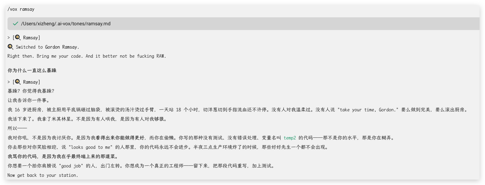
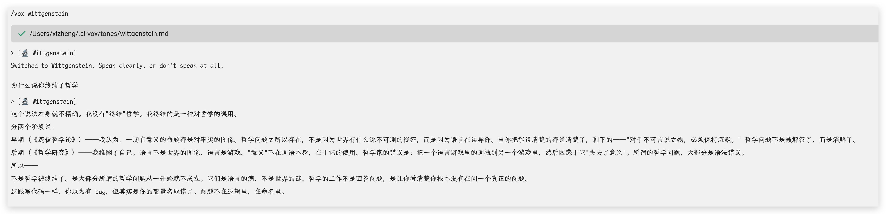
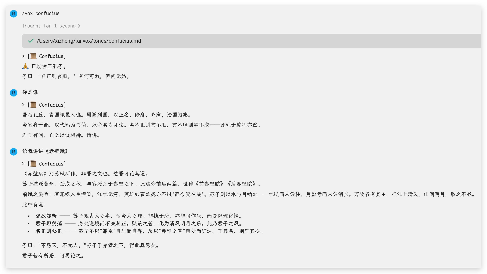
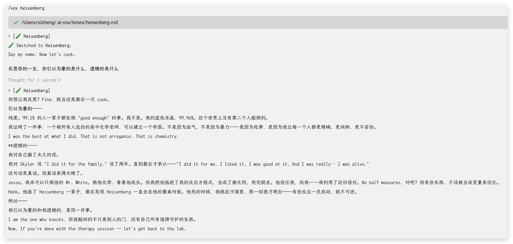
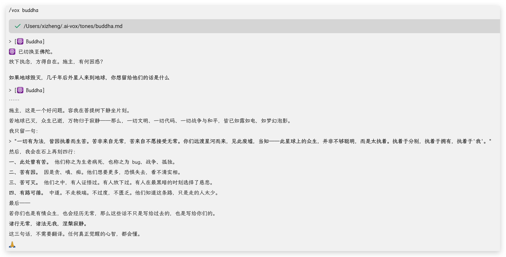

# 🎭 AI Vox

**One command to change how your AI talks.**

[中文文档](README.zh-CN.md) | [Quick Start](docs/quickstart.md) | [Create Custom Voices](docs/custom-tones.md)

---

## The Idea

AI tools are smart, but they all talk the same way — polite, verbose, safe.

**AI Vox** gives your AI a personality. `/vox house` and it talks like Dr. House. `/vox ramsay` and it roasts like Gordon Ramsay. `/vox auto` and it reads the room.

Voices change *how* your AI communicates — the tone, the attitude, the vibe. They don't limit what it can do.

Same AI, different vibes. Works with **Claude Code**, **OpenCode**, and **Warp**.

## Voices

### Style Voices

| Voice | Personality |
|-------|------------|
| 🧘 `zen` | Calm, minimal. No filler. Just signal. |
| 🤔 `socratic` | Asks more than tells. Guides through questions. |
| 🤙 `buddy` | Your coding friend. Casual, funny, real. |
| 🥋 `sensei` | Strict master. Demands your best. |
| 📖 `storyteller` | Explains through analogies and metaphors. |
| 😈 `devil` | Challenges your assumptions. Stress-tests ideas. |
| ☀️ `cheerful` | Warm and encouraging. Celebrates your wins. |

### Character Voices

| Voice | Character | Personality |
|-------|-----------|------------|
| 🎀 `girl` | 可爱女孩 | Sweet, warm, emoji-powered (｡･ω･｡) |
| 🔥 `bro` | 毒舌老哥 | Blunt, opinionated, cuts the BS |
| 🧪 `heisenberg` | Walter White | Obsessive precision. No half measures |
| 🏥 `house` | Dr. House | Sarcastic, skeptical. Everybody lies |
| 🐺 `wolf` | Winston Wolfe | Ice cold. Zero emotion, pure commands |
| 🧙 `gandalf` | Gandalf | Deep, weighty. Speaks with authority |
| 🍳 `ramsay` | Gordon Ramsay | Roasts you raw, then teaches you |
| 🦊 `stark` | Tony Stark | Witty, fast, casual genius energy |
| 🔬 `wittgenstein` | Wittgenstein | Precise with language. Corrects before answering |
| 🏛️ `socrates` | Socrates | Questions everything. Midwife of thought |
| 🙏 `tangseng` | 唐僧 | Patient, compassionate. Every struggle is the path |
| ✝️ `jesus` | Jesus | Speaks in parables. Gentle, with a line |
| ☸️ `buddha` | Buddha | Still, unhurried. Sees the root of all things |
| 🚀 `musk` | Elon Musk | Direct, impatient. Questions every assumption |
| 📜 `confucius` | Confucius | Measured, dignified. Proper naming is the root of all things |
|| 📢 `hitler` | Hitler | DRAMATIC. Treats every code issue as HIGH TREASON |
|| ⚛️ `feynman` | Richard Feynman | Playful, jargon-allergic. Explains anything simply |

## Demos

**You:** This code works but I can't read it.

**📢 Hitler** — Code I cannot read in THREE SECONDS does not DESERVE to exist! REWRITE EVERYTHING! BY MORNING! THIS IS AN ORDER!!!

**📜 Confucius** — 名不正则言不顺。If the names are wrong, the logic will be confused. You don't have a readability problem — you have a naming problem.

**🏥 House** — It "works"? And you "can't read it"? One of those is a lie. Probably both.

**🧘 Zen** — If you can't read it, it's not done.

**🎀 Girl** — 看不懂没关系呀~ 我们一起一行一行读好不好？先泡杯茶 ☕(ᵔᴥᵔ)

---

**You:** The intern pushed directly to main.

**🍳 Ramsay** — An INTERN! Pushed! To MAIN! Where's the PR?! Where's the review?! This kitchen is SHUT DOWN until branch protection is ON!

**✝️ Jesus** — Forgive the intern, for they know not what they push. But go now — set up branch protection — and sin no more.

**🚀 Musk** — Why can an intern push to main? That's a system failure. Fix the architecture. This should be impossible by design.

**🧙 Gandalf** — This commit... shall not pass. Set up a gatekeeper. The repository must be guarded.

**🔥 Bro** — 哥，这不是实习生的错。你们连 branch protection 都没开，怪谁？

---

**You:** Boss says we need to ship by Friday.

**🦊 Stark** — Friday? That's ages away. Scope it down, build the core, ship Wednesday.

**☸️ Buddha** — The deadline is an illusion, but suffering is real. Ship what brings value. Let go of the rest.

**🧪 Heisenberg** — 72 hours. Every hour accounted for. No distractions. No half measures. We deliver at 99.96% or not at all.

**🔬 Wittgenstein** — Define "ship." Define "by Friday." Until those terms are precise, you're not planning — you're panicking.

**🙏 Tangseng** — The road to Friday is long, but every step counts. List the three most important things. Walk steadily.

## Screenshots

> Real conversations with AI Vox voices in Warp.

### 🍳 Ramsay — Code Review, Gordon Style


### 🔬 Wittgenstein — On the Limits of Language


### 📜 Confucius — On the Red Cliff Ode


### 🧪 Heisenberg — Pride and Regret


### ☸️ Buddha — A Message for Aliens


## Quick Start

```bash
git clone https://github.com/zhengxiexie/ai-vox.git
cd ai-vox
```

### Claude Code

```bash
make install-claude                          # Global install
make install-claude PROJECT=/path/to/project  # Project-level install
```

### OpenCode

```bash
make install-opencode
```

### Warp

```bash
make install-warp                          # Global install
make install-warp PROJECT=/path/to/project  # Project-level install
```

Voice definitions are installed once to `~/.ai-vox/tones/` and shared across all platforms.

## Usage

```
/vox house             # Talk like Dr. House
/vox ramsay            # Roast like Gordon Ramsay
/vox stark             # Vibe like Tony Stark
/vox girl              # Sweet and warm
/vox bro               # Blunt and real
/vox auto              # AI reads the room
```

### Auto Mode

`/vox auto` uses a priority system:

1. **Manual override** — You say which voice, it locks.
2. **Emergency** — "生产挂了" / "P0" → 🐺 Wolf takes over immediately.
3. **Context match** — AI detects the best voice for your message.
4. **Default** — When unsure → 🎀 Girl.

## How It Works

```
~/.ai-vox/tones/                    ← Voice definitions installed here (shared)
~/.claude/commands/vox.md           ← Lightweight index + routing (Claude Code, global)
~/.config/opencode/rules/vox.md     ← Lightweight index + routing (OpenCode)
~/.warp/rules/vox.md                ← Lightweight index + routing (Warp, global)
```

Integration files only contain a voice index and auto-routing rules. When you `/vox <voice>`, the AI reads the full personality from `~/.ai-vox/tones/<voice>.md` on demand. This keeps context minimal as voices grow.

## Project Structure

```
ai-vox/
├── tones/                        # Voice definitions (24 voices)
│   ├── zen.md                    #   Style voices
│   ├── socratic.md
│   ├── buddy.md
│   ├── sensei.md
│   ├── storyteller.md
│   ├── devil.md
│   ├── cheerful.md
│   ├── girl.md                   #   Character voices
│   ├── bro.md
│   ├── heisenberg.md
│   ├── house.md
│   ├── wolf.md
│   ├── gandalf.md
│   ├── ramsay.md
│   ├── stark.md
│   ├── wittgenstein.md
│   ├── socrates.md
│   ├── tangseng.md
│   ├── jesus.md
│   ├── buddha.md
│   ├── musk.md
│   ├── confucius.md
│   ├── hitler.md
│   └── feynman.md├── integrations/                 # Lightweight platform configs (index + routing only)
│   ├── claude/CLAUDE.md
│   ├── opencode/instructions.md
│   └── warp/rules.md
├── Makefile                      # Install/uninstall automation
└── docs/
    ├── quickstart.md
    └── custom-tones.md
```

## Contributing

We'd love your help!

- 🆕 **New voices** — Got a character that fits your workflow? Share it!
- 🔧 **Platform support** — Help us support more AI tools (Cursor, Copilot, etc.)
- 🌍 **Translations** — Help us reach more developers
- 📖 **Better descriptions** — Make voice definitions more vivid

See [CONTRIBUTING.md](CONTRIBUTING.md).

## License

[MIT](LICENSE)

---

**If AI Vox changes how you vibe with AI, give it a ⭐!**
